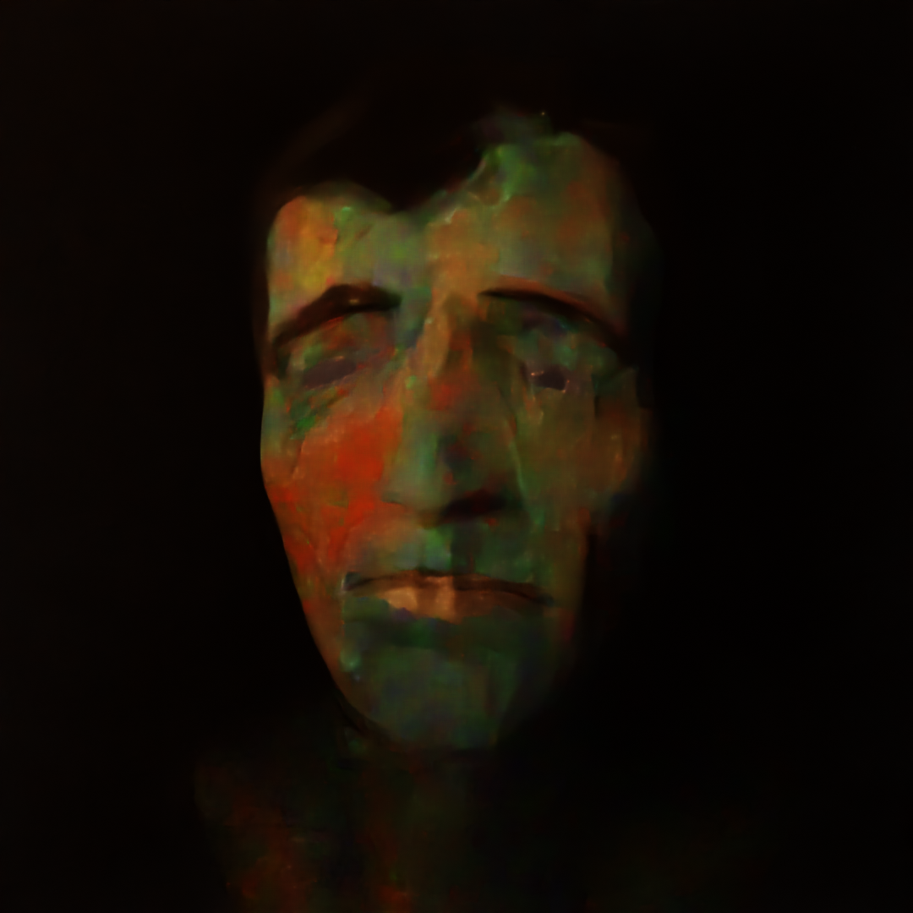
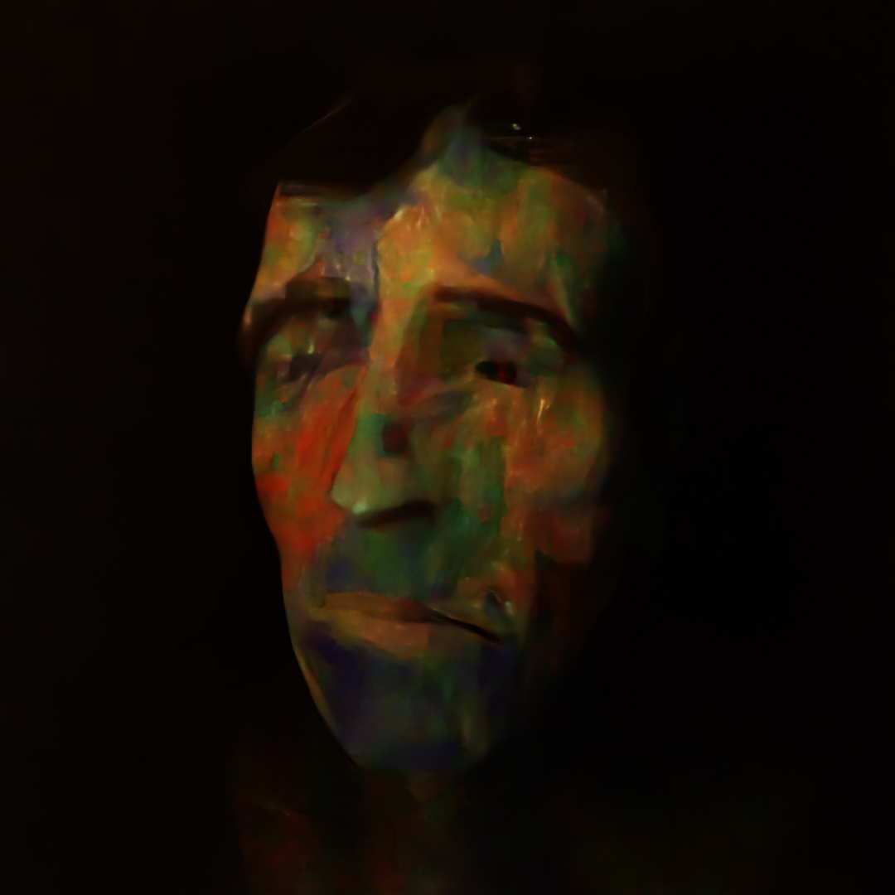
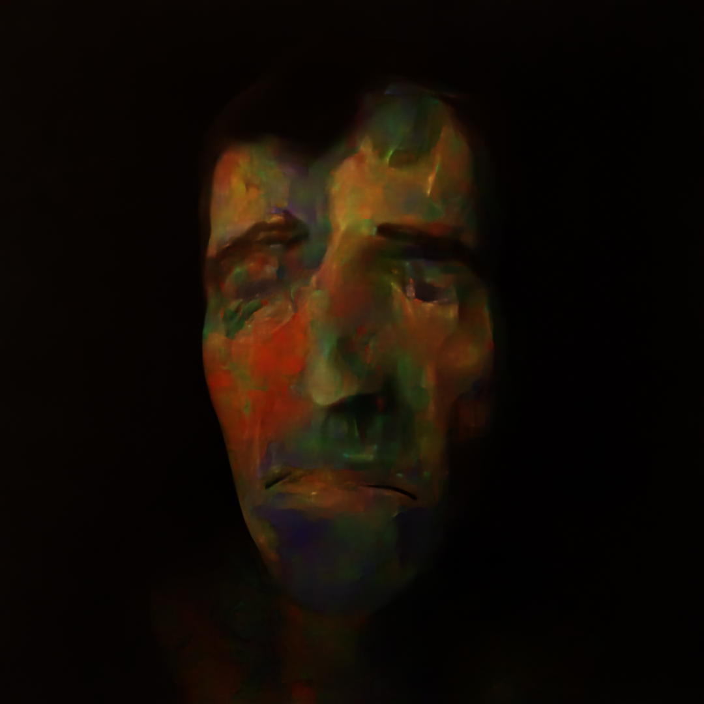
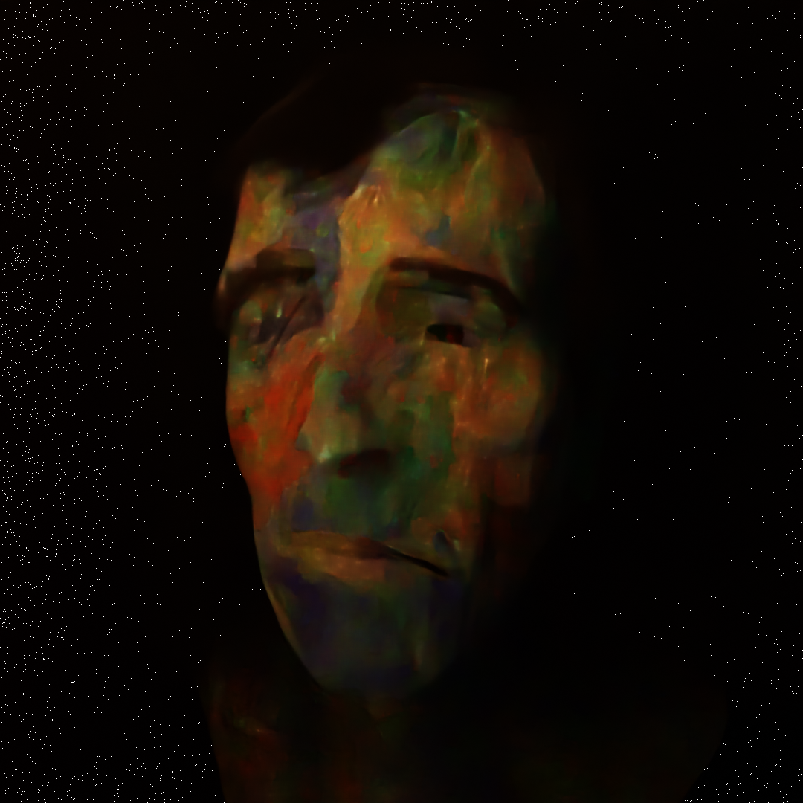

With many different iteration I finally landed on the one you can now come across everywhere. Made with a special rendering technique featuring volumetric, low quality render, denoising, experimantational lighting and post processing.

