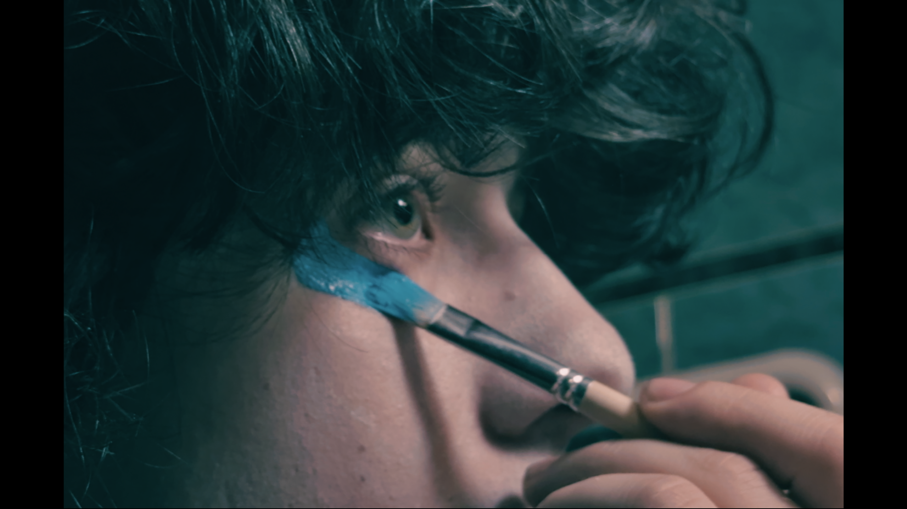
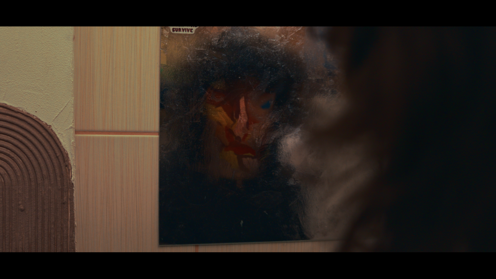
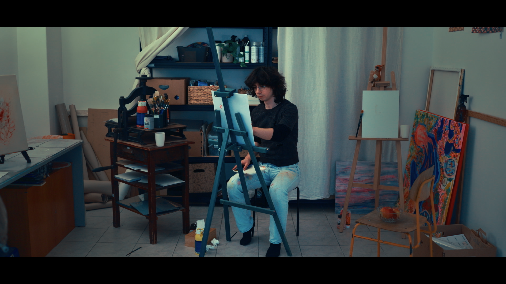
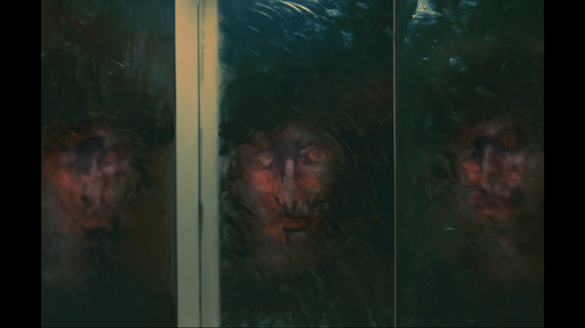

Ash, an art student, desperately struggles to complete a self-portrait for a prestigious art competition. But every brushstroke reveals something wrong - in the canvas's reflection, they don't see their own face, only a hazy, distorted version of themselves. Traumatized by childhood memories and their teacher's merciless criticism threatening expulsion, Ash begins seeing this unsettling distortion everywhere - in mirrors, windows, every reflective surface.

As the deadline approaches and panic mounts, Ash descends into a surreal night through the city, where boundaries between reality and hallucination dangerously blur. An art supply store transforms into a flooded space filled with red paint, and mirror images pursue them with every step. In this visually striking odyssey, Ash must confront the darkest aspects of their own identity and decide whether to embrace or suppress what they see in the reflection.



