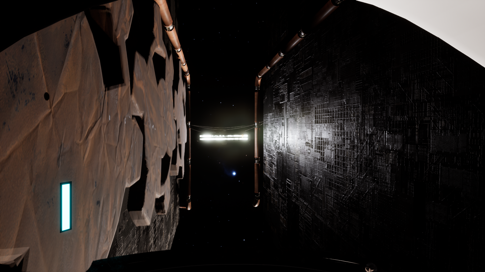
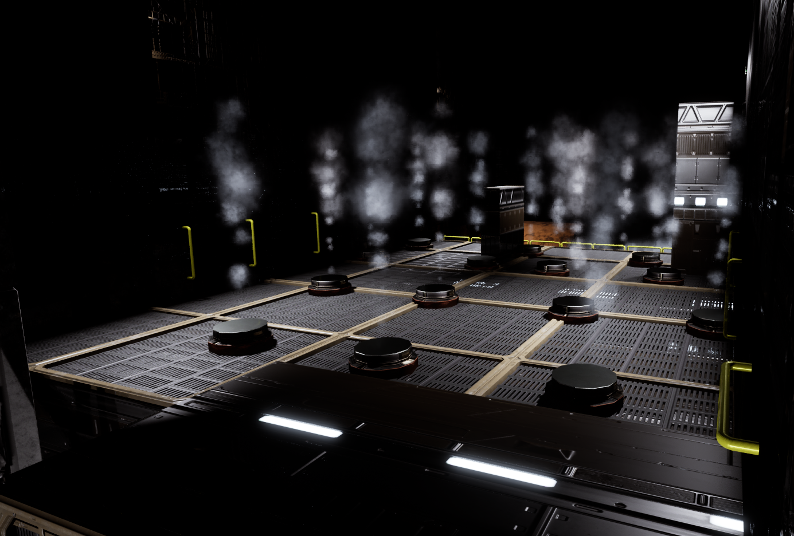
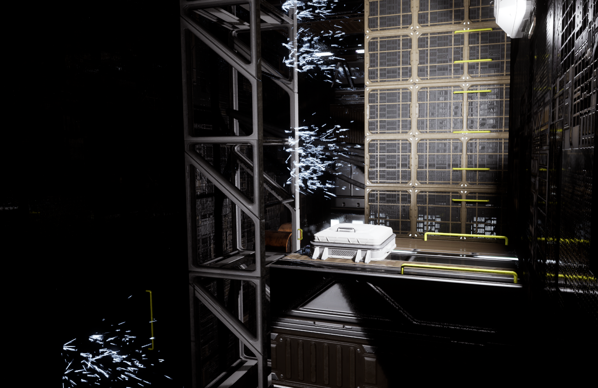
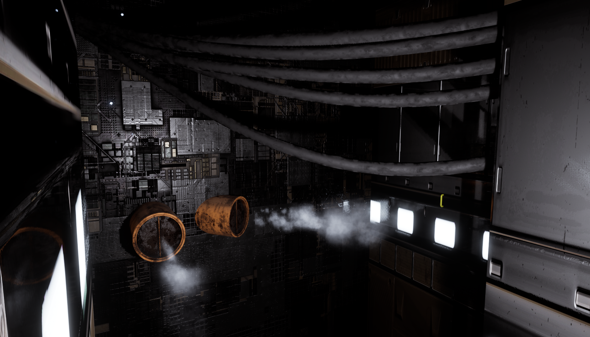
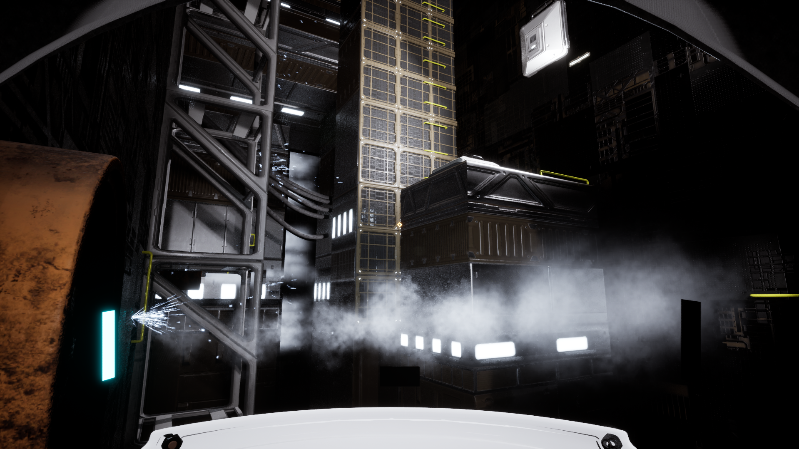

You play as an experienced space engineer. As the hardest working employee of The Infinity Corp., you were chosen to complete a truly demanding manual task.  
  
A rare breed of tasks in times of ultimate automation and scale. 

Find your way across the walls of the Infinity Station 146, and restart the shutdown module to claim your well earned salary.

https://nickada.itch.io/infinity

